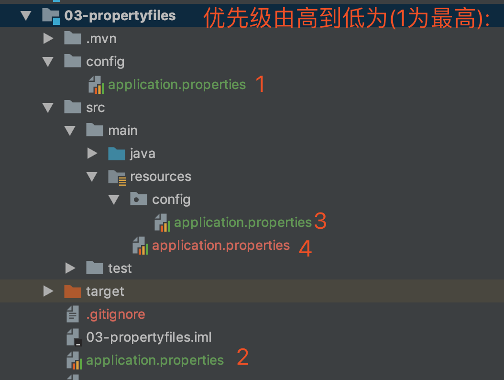

`SpringApplication`根据`application.properties`文件的位置来加载properties,优先级由高到低如下所示:

1. 当前目录的的`/config`子目录
2. 当前目录
3. classpath的`/config`
4. classpath根目录

根据以上优先级, 优先级高的会覆盖掉优先级低的.
比如我package了一个jar包到`/target`目录,并于`03-propertyfiles`目录下以`java -jar target/03-propertyfiles-0.0.1-SNAPSHOT
.jar`命令来执行该jar包,那么如图所示的四个`application.properties`的优先级如下图所示:




控制台会输出:
```bash
greeting:subdirectoryOfTheCurrentDirectory
```